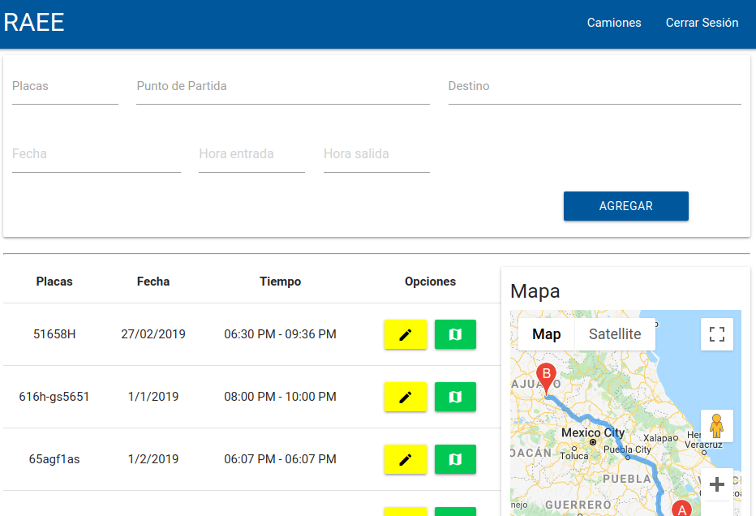
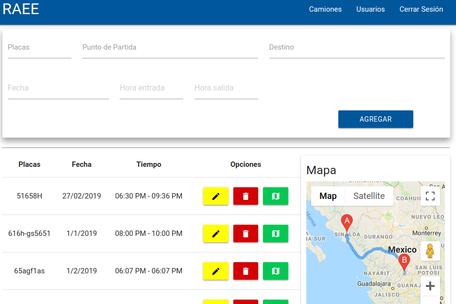
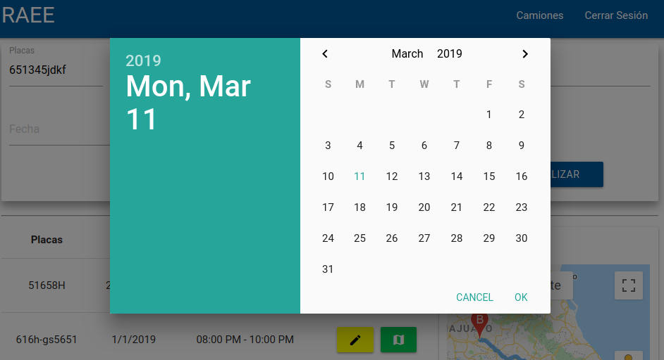
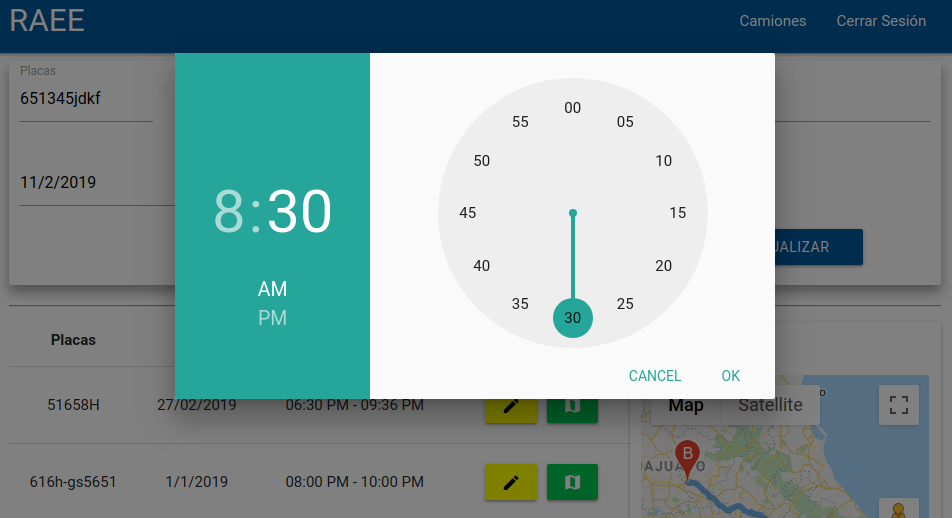
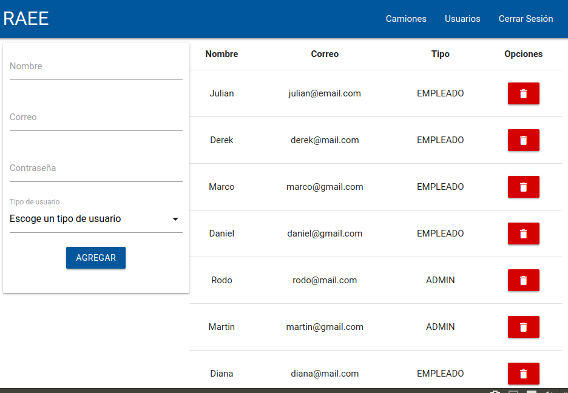

# MERN Route Maps

Esta es una web app realizada para una empresa donde necesitan el **control** de los camiones que llegan a sus bodegas para así tomar datos como las placas, punto de partida, destino, fecha, hora de entrada y de salida; de esta forma la empresa obtiene un control absoluto sobre la mercancia entrante y se puede dar cuenta facilmente de situaciones indeseadas y no perder dinero.

La app se compone de 3 componentes: **Login**, **Camiones**, **Gestion de usuarios**.

*Login:*

*Camiones desde el punto de vista de un usuario tipo empleado:*

*Camiones desde el punto de vista de un usuario tipo administrador:*

*Datepicker y timepicker con materializecss, en el componente camiones:*

*Componente gestion de usuarios, solo se tiene acceso a este si eres un administrador:*

**Funcionamiento:**
[RAEE System](https://raee-system.herokuapp.com/).
*Credenciales:*
Administrador:
- E-MAIL: admin@email.com
- PASSWORD: 456

Empleado:
- E-MAIL: empleado@email.com
- PASSWORD: 456

*(tiene una mala calidad debido a la compresión)*